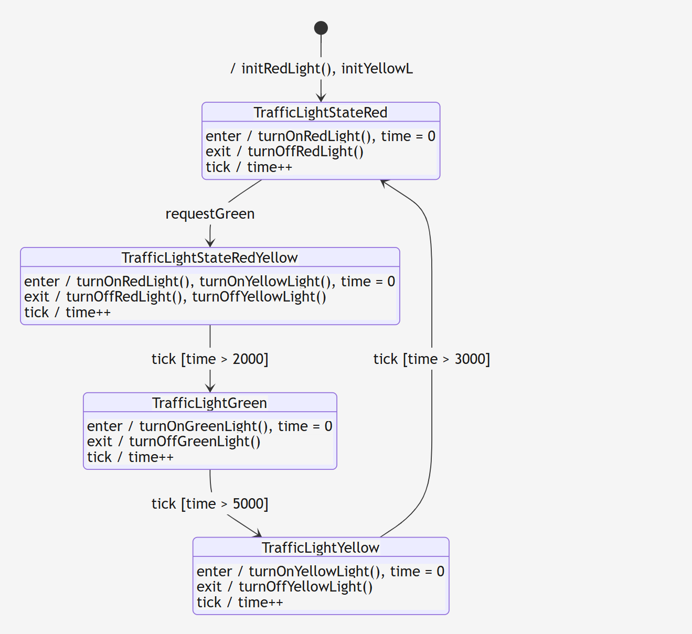

# Esp32 Ampel mit FreeRTOS

Dieses Projekt ist eine simple Ampel gesteuert durch eine UART Schnittstelle verwaltet mit FreeRTOS.
Man kann über die Serielle Schnittstelle den aktuellen Zustand der Ampel ausgeben lassen und grün anfordern.
Die Grünphase kann auch durch Drücken eines Knopfes angefordert werden.

Mittels MessageQueue werden die Aufgaben verteilt.


Ausgegeben wird ein Menü mit folgenden Auswahlmöglichkeiten:

```
    Wählen Sie einen Eintrag per Eingabe der Nummer:
    1. Auslesen des Leucht-Zustands einer Ampel
    2. Setzen des Requests bei einer Ampel

    Auswahl: ___
```

Durch die Eingabe von ```1``` wird der aktuelle Zustand der Ampel ausgegeben.
Durch die Eingabe von ```2``` wird die Grünphase angefordert.


##  Die Ampel
Das State-Diagramm der Ampel sieht folgendermaßen aus:



Mittels [State-Smith](https://github.com/StateSmith/StateSmith) wurde der Code der Ampel ausgehend von diesem State-Diagramm autogeneriert.

##  FreeRTOS

FreeRTOS ist ein kostenloses open-source Real Time Operating System für Embedded-Systems und verfügbar für viele Microcontroller.
Realisiert wurde es hier mit einer Message Queue, welche Aufgaben an die Tasks verteilt. 

##  Hardware

Benutzt wurde für dieses Projekt:
-   ESP32 Microcontroller
-   1x Rote LED
-   1x Gelbe LED
-   1x Grüne LED
-   3x Widerstand 1k Ohm
